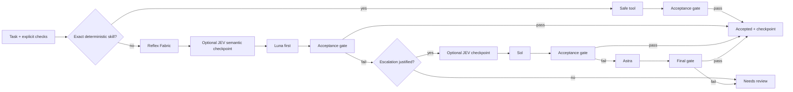

# ReflexOS — Proof-Carrying Adaptive Cognitive Routing

**Promptothon 2026 · LLMs & Automation**

> Use the smallest intelligence necessary — and prove when escalation is justified.

ReflexOS is a reproducible cognitive orchestration layer for AI agents. Instead of sending every task to the largest model, it executes exact work with deterministic tools, consults a bounded semantic router only when useful, starts every generative task on a low-cost **Luna** tier, and unlocks **Sol** or **Astra** only after observable acceptance-gate failure.

The project hybridizes three existing research lines by Francisco Angulo de Lafuente:

- **Universal Cognitive Architecture · JEV v2** — verified cache, explicit acceptance gates, bounded execution and factual checkpoints.
- **JEV Orchestrator v3** — Reflex Fabric, event-driven semantic checkpoints, LUNA-FIRST routing and evidence-gated escalation.
- **King-Skill v4** — deterministic skill routing and the principle that exact computation belongs in tools, not language-model tokens.

The competition project adds a clean provider abstraction, safe deterministic skills, a credential-free simulator, a reproducible policy benchmark, Gradio UX, CI tests, a public-notebook workflow and judge-facing documentation.

## The problem

Modern agent stacks often use a powerful model for tasks that do not need one. That creates unnecessary cost and latency, and it makes failures harder to audit. At the opposite extreme, blindly forcing every task through a cheap model can reduce quality.

ReflexOS treats model capability as a **budgeted resource**. Escalation is an explicit control-flow event backed by evidence: a failed deterministic acceptance check, uncertainty, risk, or conflicting evidence. Provider advice cannot bypass local budgets or verification.

## Architecture



### Invariants

1. Deterministic work is attempted before any LLM.
2. Luna is always the first generative tier.
3. Sol and Astra are reachable only after a failed acceptance gate and the local Reflex Fabric allows escalation.
4. JEV may advise semantic routing, uncertainty and review shape, but it cannot override budgets, safety or checks.
5. A JEV outage falls back to a conservative local router instead of blocking the workflow.
6. Only verified deterministic outputs are cached.
7. Run checkpoints contain factual telemetry, not hidden reasoning or credentials.

## Reproducible benchmark

Run:

```bash
python -m reflexos.benchmark
```

Current reference result on the included 40-task synthetic policy suite:

| Metric | Always-Astra policy | ReflexOS |
|---|---:|---:|
| Accepted tasks | 40/40 | 40/40 |
| Model calls | 40 | 37 |
| Observed tokens | 54,000 | 15,830 |
| Abstract cost units | 480 | 100 |
| Token reduction | — | **70.69%** |
| Cost-unit reduction | — | **79.17%** |

The suite contains 16 deterministic tasks, 14 easy generative tasks, 7 medium tasks and 3 hard tasks. The simulated provider assigns transparent capabilities and token/cost budgets to Luna, Sol and Astra. **This benchmark validates routing policy behavior; it is not evidence that one real frontier model is better than another, nor is it a monetary cost claim.**

Observed ReflexOS paths are deterministic by construction:

```text
16 × deterministic
14 × luna
 7 × luna -> sol
 3 × luna -> sol -> astra
```

## Quick start

Core execution has no third-party runtime dependency and does not require package installation.

```bash
python run_reflexos.py benchmark
python run_reflexos.py simulate --difficulty 0
python run_reflexos.py simulate --difficulty 1
python run_reflexos.py simulate --difficulty 2
```

On Windows, the same commands are available through `run.bat`, for example `run.bat benchmark`. An editable package installation is optional (`python -m pip install -e .`).

For the web demo, install Gradio once and launch the app directly:

```bash
python -m pip install "gradio>=5,<7"
python app.py
```

For development:

```bash
python -m pip install -e ".[dev]"
pytest
```

## Optional TypeSafe JEV integration

The repository contains no credentials. `JEVSubprocessRouter` connects to an existing JEV installation through its public JSON subprocess contract. The external connector remains responsible for authentication.

```python
from reflexos import Engine, JEVSubprocessRouter, SimulatedProvider

router = JEVSubprocessRouter(
    connector=[r"C:\path\to\python.exe", "-m", "jev_orchestrator.connection"],
    cwd=r"C:\path\to\JEV-Orchestrator",
)
engine = Engine(SimulatedProvider(), semantic_router=router)
```

If JEV is unavailable, the engine records the failure and uses `LocalSemanticRouter`; LUNA-FIRST and local verification remain unchanged.

## Deterministic skills

The current public prototype includes:

- SHA-256 hashing
- UTF-8-aware text statistics
- canonical JSON summary/fingerprint
- safe arithmetic using a strict Python AST allowlist — no `eval`, no `exec`

These are intentionally small, inspectable examples. The architecture is designed for additional typed tools without weakening the model-routing invariant.

## Acceptance checks

- `nonempty`
- `contains`
- `excludes`
- `json_equals`
- `numeric_range`

Checks are evaluated by host code. A model never marks its own answer as correct.

## Why this fits Promptothon 2026

The official Promptothon rubric emphasizes technical implementation, innovation, effective AI use, impact, UX and scalability. ReflexOS maps directly to those criteria without requiring a GPU-heavy training run:

| Rubric area | Demonstrable evidence in this repository |
|---|---|
| Innovation & Originality | Proof-carrying escalation; deterministic Reflex Fabric around semantic routing |
| Technical Implementation | Typed contracts, hard budgets, integrity-checked cache, safe skills, fallbacks, CI and tests |
| Effective Use of AI | Optional TypeSafe JEV semantic decisions plus tiered LLM execution only where useful |
| Relevance & Impact | Reduces waste, cost and latency in agent workflows while preserving explicit quality gates |
| UX & Usability | Gradio route inspector and one-click reproducible benchmark |
| Scalability & Feasibility | Provider/router interfaces, credential separation, no accelerator required for core orchestration |

## Test evidence

The repository currently passes **20/20** automated tests covering:

- safe deterministic execution and code-injection rejection
- strict acceptance checks
- cache revalidation
- mandatory Luna-first behavior
- Sol/Astra ordering after failed gates
- JEV-router failure fallback
- critical-risk human checkpoint
- hard model-call budgets
- deterministic benchmark paths and savings

Run the same gate in CI with Python 3.11 and 3.12.

## Repository layout

```text
src/reflexos/       Core engine, Reflex Fabric, routing, providers, skills, cache
app.py              Gradio demonstration
notebooks/          Kaggle/Jupyter public demonstration notebook
tests/              Automated regression tests
docs/               Competition analysis and evidence
KAGGLE_WRITEUP.md   Submission-ready writeup
DEMO_SCRIPT.md      <=3-minute judge demo script
```

## Honest limitations

- The included benchmark is synthetic and intentionally isolates routing policy; real-provider quality/cost evaluation is a separate experiment.
- Semantic routing is advisory. Passing a simple string or JSON check does not prove factual truth.
- The public prototype does not embed provider credentials or assume access to any proprietary model tier.
- Current public Promptothon pages expose no competitor writeups or notebooks, so this repository does not fabricate strategies for other teams.

## Competition source

Promptothon 2026 official Kaggle page: <https://www.kaggle.com/competitions/promptothon-2026-ai-edition>

## License

MIT License. Copyright (c) 2026 Francisco Angulo de Lafuente.
